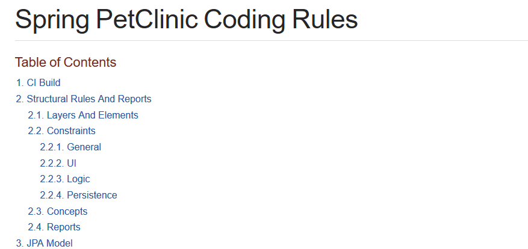
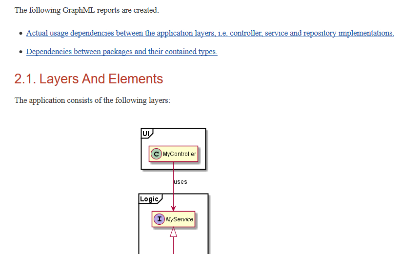
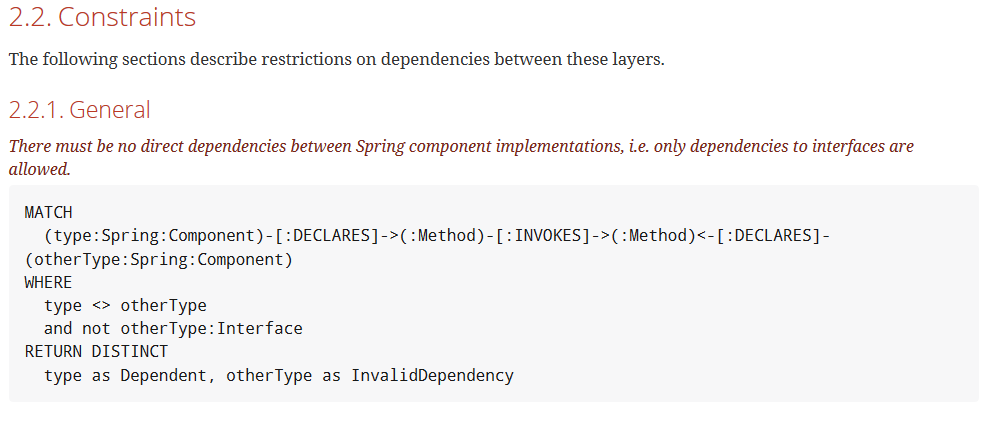
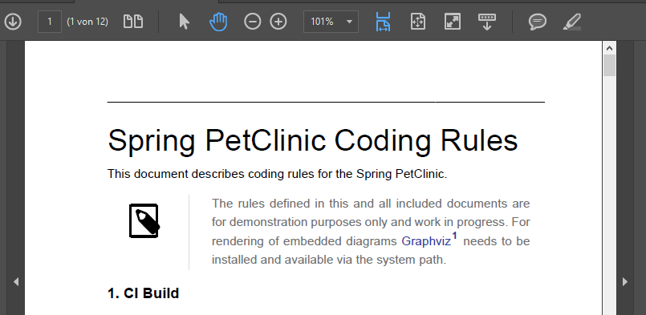
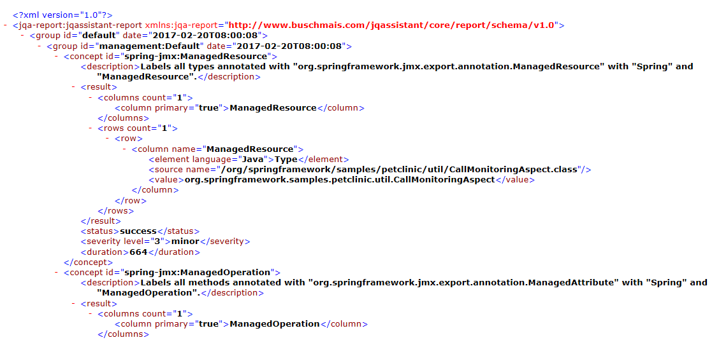
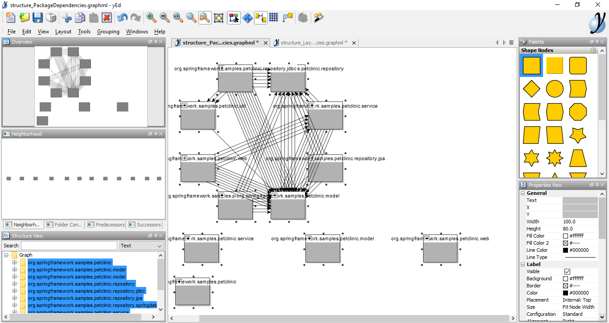
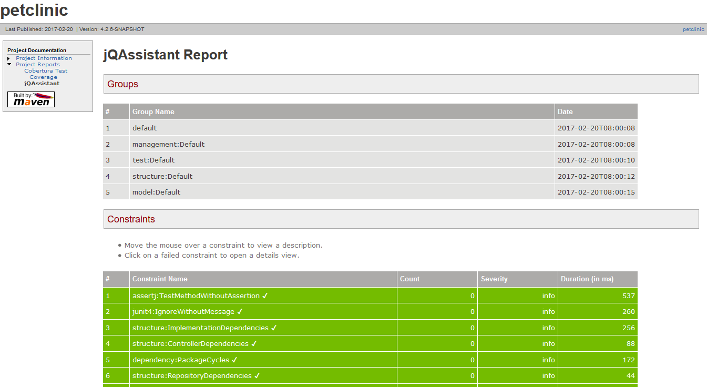

# jQAssistant demo output for Spring PetClinic #
jQAssistant ([http://www.jqassistant.org](http://www.jqassistant.org "http://www.jqassistant.org")) is a great tool for scanning  and validating software structures (like Maven projects or Java bytecode). It also brings the fantastic feature of defining all the rules that should be validated within AsciiDoc files. With this approach you'll get a **self-validating living architecture documentation**!

The creators of jQAssistant built up a showcase with the [Spring PetClinic project](https://github.com/buschmais/spring-petclinic/) for getting you started very quickly. On this page, you'll find the generated outputs of jQAssistant (also available directly on [GitHub](https://github.com/buschmais/spring-petclinic/tree/master/docs)) for that project. It's meant for people who don't have the time or setup to build the entire project with Java / Maven / GraphViz. 

The files will give you a quick impression of what jQAssistant is capable of.

## Documentation

In the following, you can see the files that will be generated with a <tt>mvn clean install</tt> and be placed in <tt>/target/generated-docs</tt>. It's the final documentation of the software architecture including design concepts and programming conventions. It contains the description of the software system in words along with "concepts" (aka the "things" your software system is made of) and "constraints" (aka "rules" that need to be behelt) written in the graph query language [Cypher](https://neo4j.com/developer/cypher-query-language/). The concepts and constraints will be applied and validated against your artifacts during the build by jQAssistant.

### [index.html](documentation/index.html)
The generated documentation as HTML files based on the AsciiDoc files in <tt>/jqassistant</tt>:

**Figure 1: Beginning of the documentation including a table of contents**

    

**Figure 2: UML diagram produced with PlantUML/GraphViz, defined directly in the AsciiDoc file**

**Figure 3: Inline defined constraints that jQAssistant will apply against your code artifacts**

  
### [index.pdf](documentation/index.pdf)
The corresponding, generated PDF documentation, also based on the AsciiDoc files, will be placed in the same directory as the HTML documentation.  

**Figure 4: Beginning of the PDF documentation**

## Reports
Within a build, jQAssistant will not only produce the documentation files, but also apply and validate your software structure. Here you can see some examples of the produced results:

### [jqassistant-report.xml](reports/jqassistant-report.xml)
The XML report with the result of the architecture validation  that will be produced with <tt>mvn clean install</tt>
  

**Figure 5: The raw XML report**

### .graphml files
You can also define some special queries in your documentation that generate diagrams. Here are some of the diagramms generated in GraphML:

* [structure_LayerDependencies.graphml](reports/structure_LayerDependencies.graphml)

* [structure_PackageDependencies.graphml](reports/structure_PackageDependencies.graphml)
  
You'll need yEd to open them. In yEd, you have to select all elements and layout them e. g. via "Layout" -> "hierarchical". But for your convenience, here you can see an example:  

**Figure 6: A diagram of some components of the software system, viewed in yEd**

### [jqassistant.html](reports/jqassistant.html)
Additionally there is nice HTML-style report, that will be generated with <tt>mvn site</tt> and included in your Maven HTML site! 
  

**Figure 7: The report in the HTML format**

Have fun exploring!
